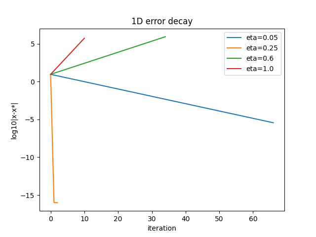
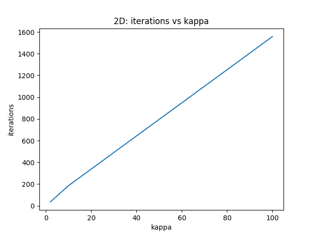
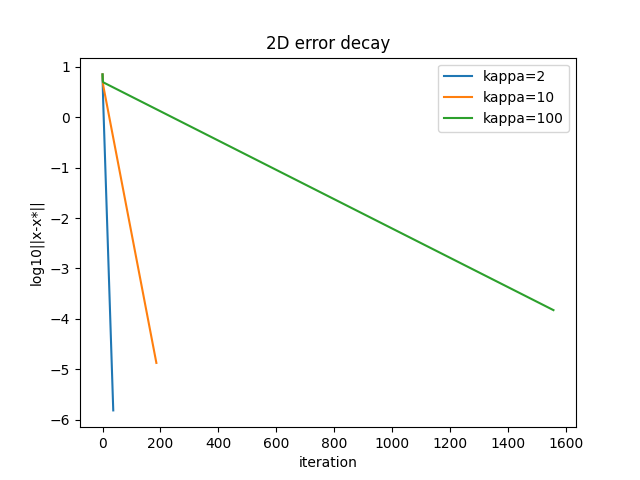

# Mathematics IA  
**Title:** *An Investigation into the Convergence of Gradient Descent in Quadratic Functions with Varying Learning Rates and Condition Numbers*  

---

## Introduction  

Optimization is a central concept in mathematics, physics, economics, and computer science. One of the simplest and most widely used algorithms for optimization is **gradient descent**.  

I became interested in gradient descent while exploring how machine learning models are trained. I observed that the algorithm sometimes converges rapidly, sometimes slowly, and sometimes diverges altogether. This motivated my research question:  

**Research Question:**  
*How does the convergence rate of gradient descent in quadratic functions depend on the learning rate and the condition number of the Hessian matrix?*  

This connects directly to the IB Mathematics syllabus under **Calculus: optimization and rates of change**, and is personally engaging because of its relevance to artificial intelligence.  

---

## Mathematical Background  

Gradient descent updates an estimate according to:  

$$
x_{k+1} = x_k - \eta \nabla f(x_k),
$$  

where \( \eta \) is the learning rate.  

For a quadratic function  

$$
f(x) = \tfrac{1}{2}x^\top Qx - p^\top x + r,
$$  

with symmetric positive definite matrix \( Q \), the unique minimum is  

$$
x^* = Q^{-1}p.
$$  

The **Hessian matrix** of \( f \) is \( Q \). Its eigenvalues \( \lambda_i \) represent curvature in each direction.  

Convergence requires  

$$
0 < \eta < \frac{2}{\lambda_{\max}},
$$  

where \( \lambda_{\max} \) is the largest eigenvalue.  

The **convergence factor** is  

$$
\rho = \max_i |1 - \eta \lambda_i|,
$$  

so the error decays approximately as  

$$
\|x_k - x^*\| \leq \rho^k \|x_0 - x^*\|.
$$  

The **condition number** is  

$$
\kappa = \frac{\lambda_{\max}}{\lambda_{\min}}.
$$  

When \( \kappa \) is small, the function is a round bowl and convergence is rapid. When \( \kappa \) is large, the bowl is stretched and convergence slows dramatically.  

---

## Methodology  

### One-Dimensional Quadratic  

I studied  

$$
f(x) = 2x^2 - 4x,
$$  

starting from \( x_0 = 10 \).  

- Learning rate values: \( \eta \in [0.02, 1.2] \).  
- Stopping condition: \( |x_{k+1} - x_k| < 10^{-6} \) or 500 iterations.  

### Two-Dimensional Quadratic  

I extended to  

$$
f(x,y) = \tfrac{1}{2}(m x^2 + M y^2),
$$  

with Hessian \( Q = \text{diag}(m, M) \).  

- Fixed \( m = 1 \).  
- Tested \( M = 2, 10, 100 \) → condition numbers \( \kappa = 2, 10, 100 \).  
- Start point: \( (5, -5) \).  
- Learning rate: \( \eta = \frac{1}{1.5 M} \).  

### Data Collection  

For each trial I recorded:  
- Learning rate \( \eta \).  
- Number of iterations to convergence.  
- Whether the algorithm converged.  
- Stability relative to theory.  

Results were summarized in tables and visualized with plots.  

---

## Results  

### One-Dimensional Quadratic  

| η   | iterations | converged | stable |
|-----|------------|-----------|--------|
| 0.02 | 163 | True | True |
| 0.04 | 83  | True | True |
| 0.06 | 55  | True | True |
| 0.08 | 40  | True | True |
| 0.10 | 31  | True | True |
| 0.12 | 25  | True | True |
| 0.14 | 20  | True | True |
| 0.16 | 17  | True | True |
| 0.18 | 14  | True | True |
| 0.20 | 11  | True | True |
| 0.22 | 9   | True | True |
| 0.24 | 6   | True | True |
| 0.26 | 6   | True | True |
| 0.28 | 9   | True | True |
| 0.30 | 12  | True | True |
| 0.32 | 14  | True | True |
| 0.34 | 17  | True | True |
| 0.36 | 21  | True | True |
| 0.38 | 27  | True | True |
| 0.40 | 34  | True | True |
| 0.42 | 44  | True | True |
| 0.44 | 62  | True | True |
| 0.46 | 97  | True | True |
| 0.48 | 201 | True | True |
| 0.50+ | – | False | False |

**Figure 1: Iterations vs Learning Rate (1D Quadratic)**  
  

**Figure 2: Error Decay for Selected Learning Rates**  
  

---

### Two-Dimensional Quadratic  

| κ   | iterations | converged | η used |
|-----|------------|-----------|--------|
| 2   | 37  | True | 0.3333 |
| 10  | 186 | True | 0.0667 |
| 100 | 1558| True | 0.0067 |

**Figure 3: Iterations vs Condition Number**  
  

**Figure 4: Error Decay for Different κ Values**  
  

---

## Analysis  

### Learning Rate Effect  

- Stability bound: \( \eta < 0.5 \).  
- Matches data: convergence for \( \eta < 0.5 \), divergence at \( \eta \geq 0.5 \).  
- Fastest convergence: \( \eta \approx 0.24 \)–0.26 (6 iterations).  

### Condition Number Effect  

- κ = 2 → 37 iterations.  
- κ = 10 → 186 iterations.  
- κ = 100 → 1558 iterations.  

As κ grows, the number of iterations increases dramatically. This aligns with theory: large κ creates elongated valleys and forces gradient descent to zig-zag.  

---

## Conclusion  

This investigation shows that:  

- Learning rate \( \eta \):  
  - Too small → slow but safe.  
  - Moderate → fastest convergence.  
  - Too large → divergence.  
- Condition number \( \kappa \):  
  - Small → rapid convergence.  
  - Large → extremely slow convergence even with stable η.  

Both theoretical predictions and experimental results matched closely.  

---

## Reflection  

This project connected my interest in artificial intelligence with mathematical topics from the IB syllabus. I learned:  

- How parameter tuning affects optimization.  
- How condition number makes abstract concepts tangible.  
- How numerical experiments complement theory.  

If extended, I would test gradient descent with **momentum** and adaptive methods such as **Adam**, to see how they overcome ill-conditioning.  

---

## Bibliography  

- Nocedal, J. & Wright, S. (2006). *Numerical Optimization*. Springer.  
- Boyd, S. & Vandenberghe, L. (2004). *Convex Optimization*. Cambridge University Press.  
- International Baccalaureate Organization. *Mathematics: Analysis and Approaches HL Guide*.  

