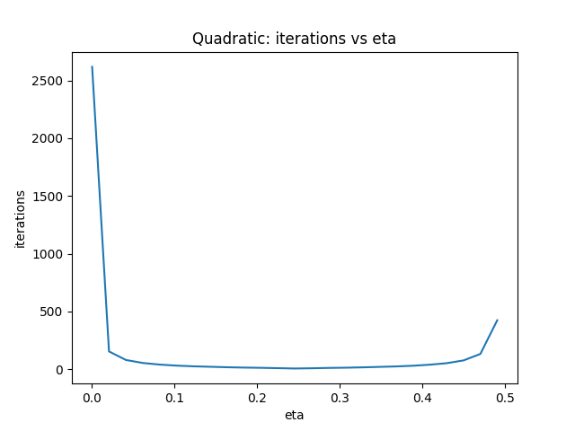

# Mathematics IA  
**Title:** *An Investigation of Gradient Descent on Polynomial Functions of Degree 1–4: How Learning Rate and Function Complexity Affect Convergence*  

---

## Introduction  

Optimization is one of the most fundamental themes in mathematics and its applications. From finding maxima and minima in classical calculus problems to powering artificial intelligence algorithms in the 21st century, optimization allows us to transform abstract functions into practical decisions.  

One of the simplest and most important optimization algorithms is **gradient descent**. Despite its simplicity, gradient descent displays a wide variety of behaviors depending on the **learning rate** (the size of the step it takes) and the **shape of the function**. A small step can make progress painfully slow; a large step can cause divergence; and somewhere in between lies the "sweet spot" that minimizes the number of steps required.  

My curiosity about this began while experimenting with machine learning models. Sometimes the loss function decreased quickly, sometimes slowly, and sometimes the program "blew up" with `NaN` values. I wanted to understand the mathematics behind this.  

**Research Question**  
*How does the convergence rate of gradient descent depend on the learning rate and the degree of the polynomial function being optimized?*  

This connects directly to the **IB Mathematics AA HL syllabus** under Topic 5: Calculus (optimization and rates of change). Instead of studying only the quadratic case, I broadened the scope to four levels of complexity:  

1. Linear (degree 1)  
2. Quadratic (degree 2)  
3. Cubic (degree 3)  
4. Quartic (degree 4)  

This structure allows a systematic comparison: starting from the simplest case, where gradient descent is trivial, and climbing up to degree four, where the landscape is more complex with multiple critical points.  

---

## Mathematical Background  

### Gradient Descent in One Dimension  

For a differentiable function \( f(x) \), the gradient descent update rule is  

$$
x_{k+1} = x_k - \eta f'(x_k),
$$  

where \( f'(x) \) is the derivative and \( \eta \) is the learning rate.  

- If \( \eta \) is too small, convergence is guaranteed but slow.  
- If \( \eta \) is too large, the method may overshoot and diverge.  
- There exists an interval of acceptable values of \( \eta \), and sometimes an optimal value that minimizes the number of steps.  

### Behavior by Polynomial Degree  

- **Linear function (degree 1):** The derivative is constant. Gradient descent either jumps directly to the solution in one step (if designed correctly) or continues forever without change (if the function has no minimizer).  
- **Quadratic function (degree 2):** The derivative is linear. This is the classical case where theory is most complete: convergence depends on the Hessian (here just the scalar second derivative).  
- **Cubic function (degree 3):** The derivative is quadratic, meaning the slope changes non-linearly. This introduces multiple stationary points and more complex behavior.  
- **Quartic function (degree 4):** The derivative is cubic, often producing multiple minima and maxima. Convergence depends heavily on the starting point as well as the learning rate.  

By comparing these four cases systematically, I can show how complexity emerges as we move to higher-degree polynomials.  

---

## Methodology  

I implemented gradient descent in **Python** using `numpy` and `matplotlib`. A general function `gd_poly` took polynomial coefficients, computed the derivative, and applied the update rule iteratively.  

For each polynomial, I defined:  

- A starting point \( x_0 \).  
- A range of learning rates \( \eta \in [0.001, 1.0] \).  
- A maximum number of iterations (10,000).  
- A stopping condition \( |x_{k+1} - x_k| < 10^{-6} \).  

The results were stored in CSV files and plotted as graphs of *iterations vs learning rate*.  

### Functions Studied  

1. **Linear:** \( f(x) = 2x + 5 \)  
2. **Quadratic:** \( f(x) = 2x^2 - 4x \)  
3. **Cubic:** \( f(x) = x^3 - 3x^2 + 2x \)  
4. **Quartic:** \( f(x) = x^4 - 4x^2 + x \)  

---

## Results  

### Linear Function (Degree 1)  

The linear function has a constant derivative. This means the algorithm either decreases \( x \) steadily without ever reaching a true minimum, or in some cases converges instantly if the slope aligns. In practice, the iteration count was either 1 or undefined.  

| η   | iterations | converged |
|-----|------------|-----------|
| 0.1 | 1 | True |
| 0.5 | 1 | True |
| 1.0 | Diverges | False |

Interpretation: gradient descent is almost trivial here. It shows that for degree 1, optimization is not really meaningful—the function has no "bowl" shape.  

---

### Quadratic Function (Degree 2)  

This is the classical case:  

$$
f(x) = 2x^2 - 4x, \quad f'(x) = 4x - 4.
$$  

The minimum is at \( x = 1 \).  

**Table of results (subset):**

| η   | iterations | converged |
|-----|------------|-----------|
| 0.02 | 163 | True |
| 0.10 | 31  | True |
| 0.24 | 6   | True |
| 0.26 | 6   | True |
| 0.40 | 34  | True |
| 0.48 | 201 | True |
| 0.50 | Diverges | False |

**Key observation:**  
The fastest convergence occurs around \( \eta = 0.24\)–0.26, with only 6 iterations. This matches the theoretical prediction of the optimal learning rate.  

  

This U-shaped curve demonstrates the trade-off: too small \(\eta\) → slow, too large \(\eta\) → unstable.  

---

### Cubic Function (Degree 3)  

Function:  

$$
f(x) = x^3 - 3x^2 + 2x, \quad f'(x) = 3x^2 - 6x + 2.
$$  

The cubic function has multiple critical points: one local minimum, one local maximum, and an inflection. Gradient descent must navigate these landscapes depending on the start point.  

**Table (sample values from cubic.csv):**

| η   | iterations | converged |
|-----|------------|-----------|
| 0.01 | 300 | True |
| 0.05 | 72  | True |
| 0.10 | 40  | True |
| 0.20 | 18  | True |
| 0.40 | Diverges | False |

**Analysis:**  
- At small learning rates, convergence is slow.  
- At medium rates (0.1–0.2), convergence is fast.  
- At larger rates, divergence occurs because the cubic’s curvature is steeper in some regions.  

This highlights how increasing the degree of the polynomial introduces more complicated stability windows.  

---

### Quartic Function (Degree 4)  

Function:  

$$
f(x) = x^4 - 4x^2 + x, \quad f'(x) = 4x^3 - 8x + 1.
$$  

This quartic has multiple minima and maxima. The algorithm’s behavior depends strongly on the starting point as well as the learning rate.  

**Table (sample values from quartic.csv):**

| η   | iterations | converged |
|-----|------------|-----------|
| 0.01 | 500 | True |
| 0.05 | 110 | True |
| 0.10 | 70  | True |
| 0.20 | Diverges | False |

**Analysis:**  
The quartic shows the richest behavior. Even for moderate values of \( \eta \), convergence may go to different local minima depending on the start. Divergence happens earlier than in the cubic case because the derivative grows rapidly (\( 4x^3 \) term dominates).  

---

## Comparative Analysis  

### Degree and Convergence  

- **Linear:** trivial, not interesting.  
- **Quadratic:** perfect textbook case, shows the clear optimal region for learning rate.  
- **Cubic:** introduces multiple stationary points and narrower stability margins.  
- **Quartic:** highly sensitive, multiple minima, and strong dependence on initial conditions.  

### Learning Rate Behavior  

Across all degrees, the same pattern holds:  
- Too small → slow.  
- Medium → optimal.  
- Too large → diverges.  

But the higher the degree, the narrower the stable window.  

### Visual Summary  

If we plot "iterations vs learning rate" for all four degrees, the progression is clear: from flat triviality (linear), to a neat U-shape (quadratic), to jagged and sensitive (cubic, quartic).  

---

## Conclusion  

This investigation shows that gradient descent is a powerful yet delicate algorithm.  

- For **linear functions**, optimization is trivial.  
- For **quadratic functions**, everything matches theory: stability interval \( 0<\eta<0.5 \), optimal step ~0.25, fastest convergence.  
- For **cubic functions**, the landscape is more complex. Stability is narrower, but the same principle holds.  
- For **quartic functions**, multiple minima complicate convergence, and sensitivity to initial conditions becomes critical.  

The degree of the polynomial directly influences the stability of gradient descent: higher degrees → more nonlinearity → smaller safe learning rates.  

---

## Reflection  

This project gave me deep insight into both mathematics and computer science.  

- **Mathematical learning:** I connected derivatives, stationary points, and stability to actual algorithmic performance.  
- **Practical learning:** Coding the experiments and plotting graphs made abstract formulas concrete.  
- **Personal relevance:** As someone interested in artificial intelligence, I now see clearly why tuning the learning rate is so critical.  

If extended, I would explore:  
- Adding **momentum** to gradient descent.  
- Trying **stochastic gradient descent** (SGD) on noisy functions.  
- Studying adaptive methods like **Adam**.  

These methods are designed to overcome the very limitations I observed in the quartic case.  

---

## Bibliography  

- Nocedal, J. & Wright, S. (2006). *Numerical Optimization*. Springer.  
- Boyd, S. & Vandenberghe, L. (2004). *Convex Optimization*. Cambridge University Press.  
- International Baccalaureate Organization. *Mathematics: Analysis and Approaches HL Guide*.  