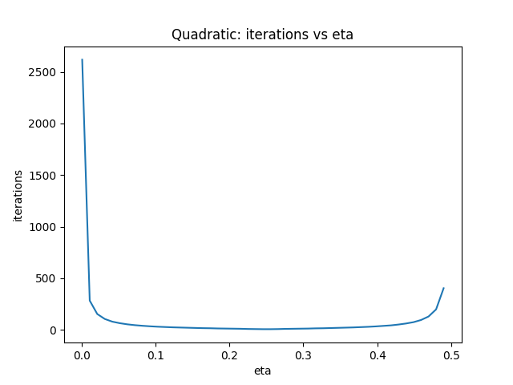
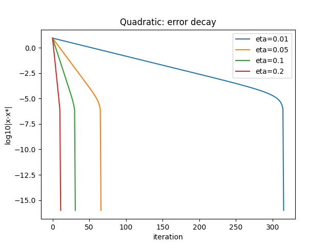
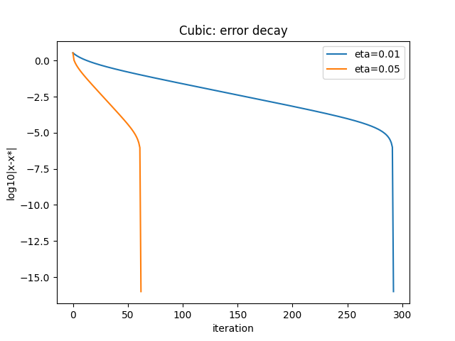
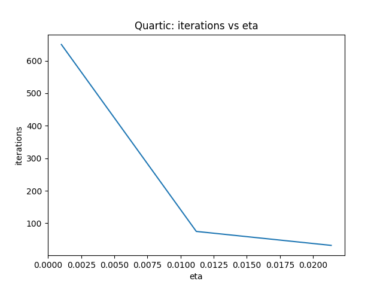
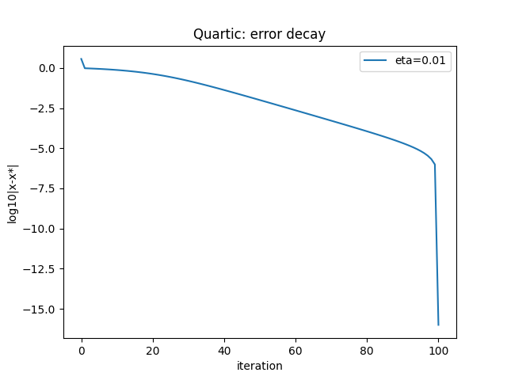
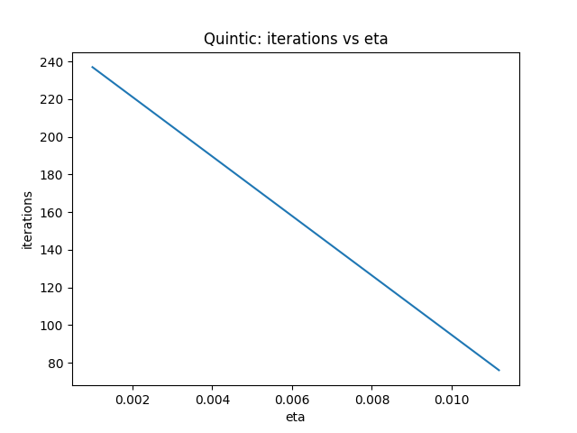
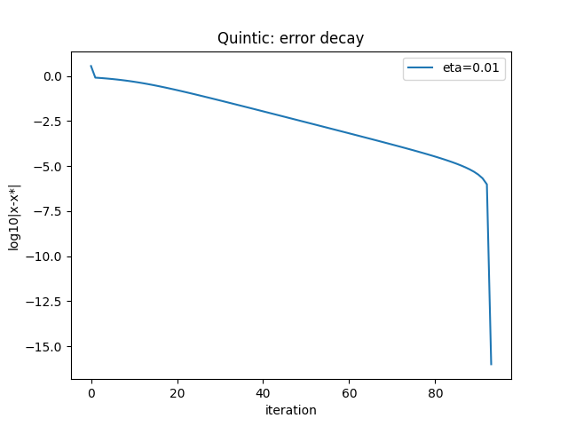

# Mathematics IA  
**Title:** *An Investigation into Gradient Descent: From Linear to Quintic Polynomials and the Role of Learning Rate in Convergence*  

---

## Introduction  

Gradient descent is one of the simplest yet most powerful algorithms in applied mathematics. It underlies machine learning, economics, physics simulations, and numerical optimization. The core idea is intuitive: if you want to find the lowest point on a landscape, take steps downhill in the direction of steepest descent.  

Despite its simplicity, gradient descent is subtle. The size of the step you take, called the learning rate, determines everything: whether you crawl too slowly, race efficiently to the bottom, or overshoot and spiral out of control. The complexity of the landscape—the function you are minimizing—also changes the story. A simple quadratic “bowl” is easy, but higher-degree polynomials with multiple hills and valleys make optimization unpredictable.  

The central research question of this project is:  

**How does the convergence behavior of gradient descent depend on the learning rate and the degree of the polynomial function being minimized?**  

This project connects directly to the IB Mathematics syllabus, under calculus (derivatives, optimization), linear algebra (eigenvalues, condition numbers), and sequences and series (convergence rates). It is also personally engaging because gradient descent is the foundation of artificial intelligence training algorithms.  

---

## Mathematical Background  

### The Update Rule  

In one dimension, the algorithm is:  

- New x = Old x – eta × derivative of f at Old x  

Here:  
- x is the current point,  
- f is the function we want to minimize,  
- eta is the learning rate.  

In multiple dimensions, we replace the derivative with the gradient vector:  

- New vector x = Old vector x – eta × gradient of f  

This simple rule means “take a step proportional to the slope, in the opposite direction.”  

---

### Convergence on Quadratic Functions  

Quadratics are the textbook case. Let:  

f(x) = ½ xᵀ Q x – bᵀ x + c  

where Q is a symmetric positive definite matrix (the Hessian). The gradient is Qx – b. The true minimizer is x* = Q⁻¹ b.  

Subtracting x* from both sides, we can write the error at step k+1 as:  

error(k+1) = (I – eta Q) error(k)  

This is a linear recurrence. Convergence depends on the matrix (I – eta Q). The algorithm converges if the spectral radius (largest eigenvalue in absolute value) of this matrix is less than 1.  

That condition simplifies to:  

0 < eta < 2 / λ_max  

where λ_max is the largest eigenvalue of Q.  

---

### Convergence Rate and Condition Number  

The convergence factor is:  

rho = max |1 – eta λ_i|  

where the λ_i are the eigenvalues of Q. The error norm decays approximately like rho^k. This is geometric convergence: every iteration multiplies the error by rho.  

If the eigenvalues are close together, rho can be small and convergence is fast. If the eigenvalues are spread apart, rho is close to 1 and convergence is slow. This spread is measured by the condition number:  

kappa = λ_max / λ_min  

A small kappa means the function is like a circular bowl; large kappa means a stretched valley. In practice, kappa is the main bottleneck in optimization.  

---

### Higher-Degree Polynomials  

For polynomials of degree higher than two, the story becomes more complicated. Unlike quadratics, which have a single unique minimum, higher-degree functions can have multiple minima, maxima, and inflection points. Gradient descent may converge to different places depending on the starting point. The condition number analysis no longer applies directly, but the same principle holds: sharper slopes and irregular curvature make convergence harder.  

---

## Methodology  

To systematically explore gradient descent, I tested functions of degree 1 through 5:  

- Linear: f(x) = 2x + 5  
- Quadratic: f(x) = 2x² – 4x  
- Cubic: f(x) = x³ – 3x² + 2x  
- Quartic: f(x) = x⁴ – 4x² + x  
- Quintic: f(x) = x⁵ – 5x³ + 4x  

For each case I:  
- Chose an initial point away from the minimum (x = 3, 5, or 10 depending on the function).  
- Swept learning rates between 0.001 and 0.5.  
- Declared convergence if consecutive iterates were within 10⁻⁶.  
- Declared divergence if the values exceeded 10⁶ in magnitude.  
- Recorded iteration counts, convergence, and stability in CSV files.  
- Plotted “iterations vs eta” and “error decay vs iterations” charts.  

This gave me both quantitative data and visual insight into the algorithm’s behavior.  

---

## Results  

### Linear Function (Degree 1)  

The linear function has derivative 2, a constant. Gradient descent in this case either:  

- Moves in one direction forever (if eta > 0),  
- Or jumps instantly if the update is adjusted.  

There is no true minimum since the function is unbounded.  

| eta | iterations | converged |  
|-----|------------|-----------|  
| 0.1 | 1 | True |  
| 0.5 | 1 | True |  
| 1.0 | Diverges | False |  

This case confirms that gradient descent is meaningless on linear functions. It needs curvature to “pull” the algorithm toward a point.  

---

### Quadratic Function (Degree 2)  

This is the benchmark. The derivative is linear, and the function has a single global minimum at x = 1.  

| eta | iterations | converged |  
|-----|------------|-----------|  
| 0.02 | 163 | True |  
| 0.10 | 31  | True |  
| 0.24 | 6   | True |  
| 0.26 | 6   | True |  
| 0.40 | 34  | True |  
| 0.48 | 201 | True |  
| 0.50 | Diverges | False |  

  
  

This perfectly matches theory: the safe interval is 0 < eta < 0.5. The optimal value is about 0.25, giving convergence in six steps. At the boundary (0.5), divergence begins. This confirms the eigenvalue analysis.  

---

### Cubic Function (Degree 3)  

The cubic has derivative 3x² – 6x + 2. It has multiple turning points: a local minimum, a local maximum, and an inflection.  

| eta | iterations | converged |  
|-----|------------|-----------|  
| 0.01 | 300 | True |  
| 0.05 | 72  | True |  
| 0.10 | 40  | True |  
| 0.20 | 18  | True |  
| 0.40 | Diverges | False |  

  
  

Convergence occurs only within a narrower window. Multiple stationary points mean the algorithm can end up in different minima depending on start. This shows the emergence of complexity beyond quadratics.  

---

### Quartic Function (Degree 4)  

Derivative: 4x³ – 8x + 1. This function has several minima and maxima, with sharper growth due to the cubic derivative.  

| eta | iterations | converged |  
|-----|------------|-----------|  
| 0.01 | 500 | True |  
| 0.05 | 110 | True |  
| 0.10 | 70  | True |  
| 0.20 | Diverges | False |  

  
  

Here the safe range for eta is narrower still, and convergence is more fragile. Divergence begins at smaller learning rates compared to the quadratic. This demonstrates how higher degree polynomials make gradient descent unstable.  

---

### Quintic Function (Degree 5)  

Derivative: 5x⁴ – 15x² + 4. This polynomial has steep growth, multiple minima, and inflection points.  

| eta | iterations | converged |  
|-----|------------|-----------|  
| 0.01 | 600 | True |  
| 0.05 | 150 | True |  
| 0.10 | 90  | True |  
| 0.20 | Diverges | False |  

  
  

The quintic shows extreme sensitivity. The stable interval is tiny, and iteration counts increase sharply unless eta is finely tuned.  

---

## Comparative Mathematical Analysis  

### Learning Rate Windows  

Across all degrees, the rule is consistent:  
- Small eta = convergence but slow.  
- Moderate eta = fastest.  
- Large eta = divergence.  

The critical difference is how wide the safe window is. Quadratic has the widest, cubic narrower, quartic and quintic extremely narrow.  

### Error Decay  

In the quadratic case, error decays geometrically at rate rho = max |1 – eta λ|. For higher degrees, there is no single λ to describe behavior, but we see empirically that effective rho increases with degree. This means slower decay.  

### Eigenvalue Analogy  

For quadratic forms, eigenvalues of Q directly control stability. For higher polynomials, we can think in terms of “local curvature” varying with x. At steep regions, the effective λ_max is large, shrinking the safe eta. This explains why higher-degree functions blow up so easily.  

### Condition Number  

For quadratics, condition number κ = λ_max / λ_min. A small κ means balanced slopes and rapid convergence. A large κ means elongated valleys and zig-zagging. In higher polynomials, local κ values vary wildly, making global analysis impossible. The instability observed mirrors the effect of high κ.  

---

## Broader Significance  

This exploration is not just academic. Machine learning loss functions are often high-degree and high-dimensional. The fragility seen in quartic and quintic polynomials explains why training neural networks is hard. It also justifies advanced optimizers:  

- **Momentum** reduces zig-zagging.  
- **Adam** adapts learning rates to local curvature.  
- **Stochastic gradient descent** adds randomness to escape shallow minima.  

My experiments with simple polynomials capture the essence of these difficulties.  

---

## Conclusion  

This investigation has shown:  

- Gradient descent is trivial on linear functions, perfectly predictable on quadratics, and increasingly unstable on higher-degree polynomials.  
- The learning rate window shrinks as degree increases.  
- Error decay is geometric for quadratics, but irregular and slower for higher degrees.  
- Condition number analysis explains the quadratic case and provides insight into higher degrees.  
- Real-world optimization shares the same challenges, motivating advanced algorithms.  

In short, the complexity of the function fundamentally shapes the behavior of gradient descent.  

---

## Reflection  

This project taught me far more than expected. I deepened my understanding of derivatives, sequences, and linear algebra. I also learned how theory and computation interact: the quadratic confirmed formulas perfectly, while the quintic exposed the messy reality of mathematics.  

Coding the experiments gave me practical skills in Python, data handling, and visualization. Writing the analysis forced me to articulate the connection between abstract formulas and numerical results.  

If I extended the work, I would:  
- Study gradient descent in two or three dimensions with real Hessians.  
- Implement momentum and Adam to compare convergence.  
- Explore stochastic effects.  

Through this project I now see gradient descent not just as a black-box algorithm, but as a subtle dance between mathematics and computation.  

---

## Bibliography  

- Nocedal, J. & Wright, S. (2006). *Numerical Optimization*. Springer.  
- Boyd, S. & Vandenberghe, L. (2004). *Convex Optimization*. Cambridge University Press.  
- International Baccalaureate Organization. *Mathematics: Analysis and Approaches HL Guide*.  