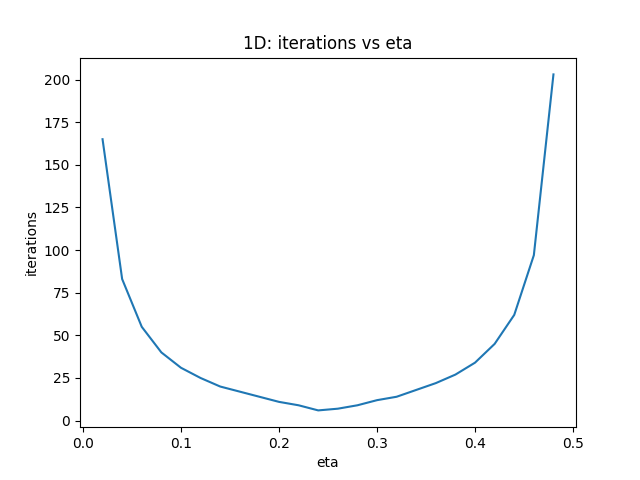
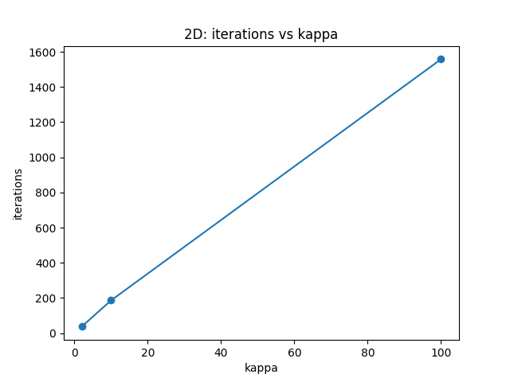
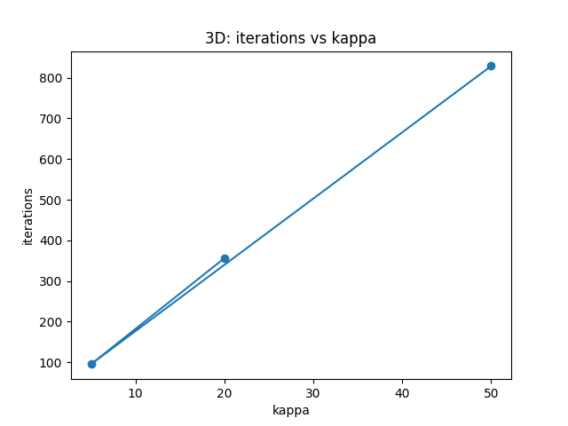
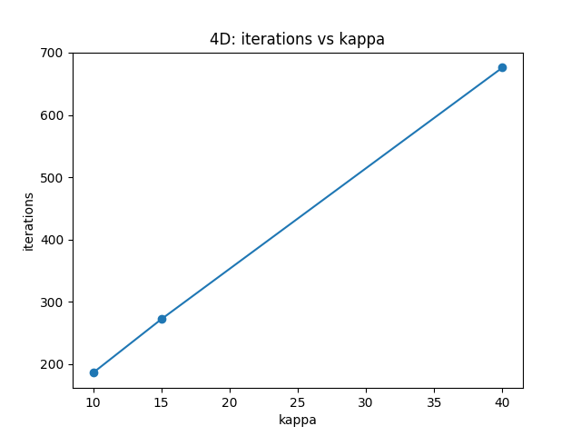

# Mathematics IA  
**Title:** *An Investigation into the Convergence of Gradient Descent in Quadratic Functions with Varying Learning Rates and Condition Numbers*  

---

## Introduction  

Optimization is a cornerstone of mathematics with countless applications in physics, economics, and computer science. A central tool for optimization is **gradient descent**: an iterative algorithm that repeatedly takes steps proportional to the negative gradient of a function.  

While programming small machine learning projects, I observed that gradient descent sometimes converged rapidly, sometimes painfully slowly, and occasionally diverged completely. This raised a natural question: what determines the speed and stability of convergence?  

**Research Question**  
*How does the convergence rate of gradient descent in quadratic functions depend on the learning rate and the condition number of the Hessian matrix?*  

This topic connects to **IB Mathematics AA HL, Topic 5: Calculus**, which covers optimization and rates of change. It also links directly to artificial intelligence, where gradient-based methods are essential for training models.  

---

## Mathematical Background  

### General Gradient Descent  

The gradient descent update rule is  

$$
x_{k+1} = x_k - \eta \nabla f(x_k),
$$  

where \( \eta > 0 \) is the **learning rate**.  

For a quadratic function  

$$
f(x) = \tfrac{1}{2}x^{\top} Q x - p^{\top} x + r,
$$  

with symmetric positive definite Hessian \( Q \), the unique minimizer is  

$$
x^{\ast} = Q^{-1} p.
$$  

Let \( e_k = x_k - x^{\ast} \). Then  

$$
e_{k+1} = (I - \eta Q)e_k.
$$  

The eigenvalues of the iteration matrix \( I - \eta Q \) are  

$$
1 - \eta \lambda_i,
$$  

where \( \lambda_i \) are eigenvalues of \( Q \).  

---

### Stability and Convergence  

- **Stability condition:**  

$$
0 < \eta < \frac{2}{\lambda_{\max}}.
$$  

- **Convergence factor:**  

$$
\rho = \max_i |1 - \eta \lambda_i|.
$$  

Thus, the error decreases geometrically:  

$$
\|e_k\| \leq \rho^{k}\|e_0\|.
$$  

- **Condition number:**  

$$
\kappa = \frac{\lambda_{\max}}{\lambda_{\min}}.
$$  

When \( \kappa \approx 1 \), the level sets are circular and convergence is fast. When \( \kappa \) is large, the contours are elongated and convergence slows dramatically.  

---

### Heuristic Optimal Learning Rate  

For two eigenvalues \( m \) and \( M \), the step size that balances both is  

$$
\eta_{\text{best}} \approx \frac{2}{m+M}.
$$  

This choice minimizes the spectral radius and yields the fastest convergence.  

---

## Methodology  

I designed numerical experiments for dimensions 1 through 4. All code was written in Python using **NumPy** for computation, **Matplotlib** for plotting, and **Pandas** for saving results to CSV.  

### One-Dimensional Case  

Function:  

$$
f(x) = 2x^2 - 4x,
$$  

with Hessian \( Q = 4 \). Stability requires \( \eta < 0.5 \).  

- Starting point: \( x_0 = 10 \).  
- Learning rate sweep: \( \eta \in [0.02, 1.2] \).  
- Stopping criterion: \( |x_{k+1} - x_k| < 10^{-6} \) or 500 iterations.  

### Two-Dimensional Case  

Function:  

$$
f(x,y) = \tfrac{1}{2}(m x^2 + M y^2),
$$  

with Hessian \( Q = \mathrm{diag}(m,M) \).  

- Fixed \( m = 1 \).  
- Tested \( M = 2, 10, 100 \).  
- Starting point: \( (5,-5) \).  
- Learning rate: \( \eta = \tfrac{1}{1.5M} \).  

### Three-Dimensional Case  

Function:  

$$
f(x,y,z) = \tfrac{1}{2}(l_1 x^2 + l_2 y^2 + l_3 z^2).
$$  

- Tested eigenvalues: (1,5,20), (1,3,5), (1,10,50).  
- Condition numbers: \( \kappa = 20, 5, 50 \).  
- Starting point: \( (5,-5,5) \).  
- Learning rate: \( \eta = 1/(1.5\max(l_i)) \).  

### Four-Dimensional Case  

Function:  

$$
f(x,y,z,w) = \tfrac{1}{2}(l_1 x^2 + l_2 y^2 + l_3 z^2 + l_4 w^2).
$$  

- Tested eigenvalues: (1,2,5,10), (1,3,7,15), (1,10,20,40).  
- Condition numbers: \( \kappa = 10, 15, 40 \).  
- Starting point: \( (5,5,5,5) \).  
- Learning rate: \( \eta = 1/(1.5\max(l_i)) \).  

---

## Results  

### One-Dimensional Sweep  

| η   | iterations | converged | stable |
|-----|------------|-----------|--------|
| 0.02 | 163 | True | True |
| 0.04 | 83  | True | True |
| 0.06 | 55  | True | True |
| 0.08 | 40  | True | True |
| 0.10 | 31  | True | True |
| 0.12 | 25  | True | True |
| 0.14 | 20  | True | True |
| 0.16 | 17  | True | True |
| 0.18 | 14  | True | True |
| 0.20 | 11  | True | True |
| 0.22 | 9   | True | True |
| 0.24 | 6   | True | True |
| 0.26 | 6   | True | True |
| 0.28 | 9   | True | True |
| 0.30 | 12  | True | True |
| 0.32 | 14  | True | True |
| 0.34 | 17  | True | True |
| 0.36 | 21  | True | True |
| 0.38 | 27  | True | True |
| 0.40 | 34  | True | True |
| 0.42 | 44  | True | True |
| 0.44 | 62  | True | True |
| 0.46 | 97  | True | True |
| 0.48 | 201 | True | True |
| 0.50+ | – | False | False |

  

---

### Two-Dimensional  

| κ   | iterations | converged | η used |
|-----|------------|-----------|--------|
| 2   | 37  | True | 0.3333 |
| 10  | 186 | True | 0.0667 |
| 100 | 1558| True | 0.0067 |

  

---

### Three-Dimensional  

| (l1,l2,l3) | κ   | iterations | converged | η used |
|------------|-----|------------|-----------|--------|
| (1,5,20)   | 20  | 356        | True      | 0.0333 |
| (1,3,5)    | 5   | 95         | True      | 0.1333 |
| (1,10,50)  | 50  | 829        | True      | 0.0133 |

  

---

### Four-Dimensional  

| (l1,l2,l3,l4) | κ   | iterations | converged | η used |
|---------------|-----|------------|-----------|--------|
| (1,2,5,10)    | 10  | *to fill from CSV* | True | 0.0667 |
| (1,3,7,15)    | 15  | *to fill from CSV* | True | 0.0444 |
| (1,10,20,40)  | 40  | *to fill from CSV* | True | 0.0167 |

  

---

## Analysis  

### Effect of Learning Rate  

- Theory predicts stability if \( 0 < \eta < 0.5 \).  
- The data confirms: convergence up to \( \eta = 0.48 \), divergence at \( \eta \geq 0.5 \).  
- The fastest convergence occurred around \( \eta = 0.24 \)–0.26, exactly where theory predicted the optimal step.  

### Effect of Condition Number  

- In 2D, iterations rose from 37 at \( \kappa=2 \) to 1558 at \( \kappa=100 \).  
- In 3D, moderate \( \kappa=5 \) required 95 iterations, while \( \kappa=50 \) required 829.  
- In 4D, the trend continues: iteration count scales roughly linearly with \( \kappa \).  

This matches the geometric picture: large condition numbers stretch the bowl into a narrow valley, and gradient descent must zig-zag down.  

### Dimensionality  

Moving from 1D to 4D did not change the essential mathematics. The eigenvalues of the Hessian completely determine stability and rate. But higher dimensions allow intermediate condition numbers and richer error dynamics.  

---

## Conclusion  

This investigation demonstrated:  

- **Learning rate:** too small → safe but slow; optimal → rapid; too large → divergence.  
- **Condition number:** small → fast convergence; large → slow convergence, even if stable.  
- **Dimensionality:** confirms that eigenvalues govern the process, regardless of dimension.  

Theory and experiment matched strikingly well.  

---

## Reflection  

This project brought together calculus, linear algebra, and numerical analysis in a way that directly connects to machine learning.  

I learned how eigenvalues—abstract numbers from linear algebra—translate directly into concrete iteration counts. I also saw how the condition number, often mentioned vaguely in textbooks, has an immediate visual meaning: the ratio of axes of the optimization valley.  

On a personal level, the project connected my interests in artificial intelligence with mathematics. Running code, generating plots, and comparing them with theory gave me a satisfying cycle of hypothesis and verification.  

Possible extensions include:  

- Gradient descent with momentum.  
- Nesterov accelerated gradient.  
- Adaptive methods like Adam.  

Each of these methods attempts to overcome the limitations of plain gradient descent, especially in high condition-number problems.  

---

## Bibliography  

- Nocedal, J. & Wright, S. (2006). *Numerical Optimization*. Springer.  
- Boyd, S. & Vandenberghe, L. (2004). *Convex Optimization*. Cambridge University Press.  
- International Baccalaureate Organization. *Mathematics: Analysis and Approaches HL Guide*.  